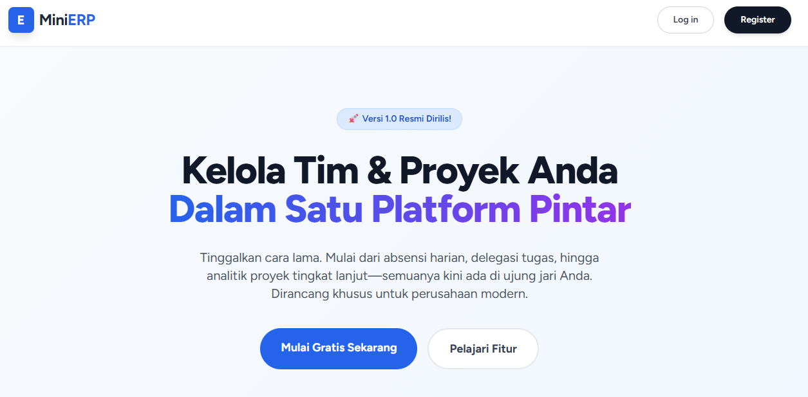

# 🚀 Mini ERP - Smart HR & Task Management System

Sebuah sistem *Enterprise Resource Planning* (ERP) mini berbasis web yang dirancang untuk mendigitalisasi proses HRD dan manajemen proyek. Dibangun dengan fondasi arsitektur MVC menggunakan **Laravel** dan antarmuka modern yang responsif menggunakan **Tailwind CSS**.

🌍 **Live Demo:** [https://mini-erp.rf.gd/](https://mini-erp.rf.gd/)

## ✨ Fitur Utama (Core Features)

Aplikasi ini memiliki pembagian hak akses (*Role-Based Access Control*) yang ketat antara **Manager** dan **Staff/Karyawan**.

### 👩‍💼 Panel Manager (Admin)
* **Dashboard Analytics:** Visualisasi data real-time untuk total proyek, tugas aktif, dan metrik penyelesaian.
* **Manajemen Proyek:** Sistem CRUD (Create, Read, Update, Delete) untuk mengelola data proyek perusahaan.
* **Delegasi Tugas:** Memberikan tugas spesifik kepada staf lengkap dengan level prioritas (Low/Medium/High) dan tenggat waktu.
* **Review Bukti Kerja:** Mengunduh dan memverifikasi file laporan/bukti kerja yang diunggah oleh staf.

### 👨‍💻 Panel Staff (Karyawan)
* **Smart Attendance:** Fitur absensi (Clock In / Clock Out) harian yang tercatat secara presisi oleh sistem.
* **Task Workspace:** Melihat daftar tugas yang didelegasikan secara spesifik untuk akun mereka.
* **Progres & Pelaporan:** Memperbarui status tugas (*Pending*, *On Progress*, *Completed*).
* **File Attachment:** Mengunggah dokumen bukti penyelesaian tugas (PDF, JPG, PNG, ZIP) secara aman.

## 🛠️ Tech Stack

* **Backend:** Laravel 11.x (PHP 8.2+)
* **Frontend:** Blade Templating, Tailwind CSS, Alpine.js
* **Database:** MySQL
* **Storage:** Laravel Local Storage (Symlink)
* **Authentication:** Laravel Breeze
